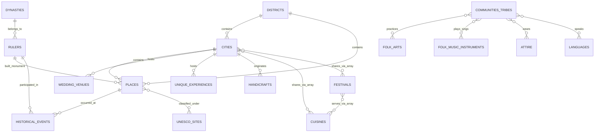

# 🕌 Rajasthan Connect - Database Design Report
This report outlines the proposed relational database architecture for the **Rajasthan Connect** application. It details how to structure, store, and interconnect the **19 available datasets** (covering cities, forts, dynasties, cuisine, folk arts, languages, etc.) to support a seamless, premium user experience.

---

## 🗃️ 1. Database Architecture Recommendation: PostgreSQL (via Supabase)

We recommend using a **Hybrid Relational Database Model** built on **PostgreSQL (Supabase)**. 

### Why PostgreSQL/Supabase is the Optimal Choice:
1. **Rich Relationships**: The 19 datasets are deeply interconnected (e.g., a City has Places, Places were built by Rulers, Rulers belonged to Dynasties, Dynasties had primary Languages, etc.). A relational database excels at these query joins.
2. **Polymorphic / Single-Table Inheritance**: Instead of creating 10 different tables for different types of "Places" (forts, palaces, lakes, wildlife reserves), we can use a single `places` table with a `category` discriminator. This simplifies queries and frontend routing.
3. **PostgreSQL Native Array (`TEXT[]`) & JSONB Support**:
   - Instead of dozens of small junction tables, we can store foreign keys using native text arrays (e.g., `related_city_ids TEXT[]`).
   - This approach matches the application's existing codebase (which runs in **local fallback mode** when Supabase is offline, using flat JS array filters like `.includes()`).
   - It is highly optimized for AI-driven data generation: writing AI prompts that output clean JSON objects with array associations (e.g. `related_foods: ["ghewar", "dal-baati"]`) is far simpler than generating split normalization scripts.
   - Postgres **GIN indexes** allow searching arrays (using the `@>` contains operator) at near-instant speeds.

---

## 🗺️ 2. Entity Relationship Diagram (ERD)

The following diagram illustrates how the entities in Rajasthan Connect link together. Notice how the **Districts & Cities** act as geographical anchors, while **Dynasties & Rulers** act as historical anchors, and all cultural components (Folk Arts, Music, Cuisine) branch out from them.



---

## 🏛️ 3. Table Schema Definitions (Supabase SQL DDL)

Copy and run these statements in your Supabase SQL Editor to initialize the database. Existing tables are expanded to maintain compatibility with your current schema while adding full relational depth.

```sql
-- Clean up tables for fresh setup
DROP TABLE IF EXISTS reviews CASCADE;
DROP TABLE IF EXISTS directory_listings CASCADE;
DROP TABLE IF EXISTS unique_experiences CASCADE;
DROP TABLE IF EXISTS royal_wedding_venues CASCADE;
DROP TABLE IF EXISTS unesco_sites CASCADE;
DROP TABLE IF EXISTS cultural_etiquette CASCADE;
DROP TABLE IF EXISTS communities_tribes CASCADE;
DROP TABLE IF EXISTS attire CASCADE;
DROP TABLE IF EXISTS handicrafts CASCADE;
DROP TABLE IF EXISTS folk_music_instruments CASCADE;
DROP TABLE IF EXISTS folk_arts CASCADE;
DROP TABLE IF EXISTS historical_events CASCADE;
DROP TABLE IF EXISTS history_rulers CASCADE;
DROP TABLE IF EXISTS dynasties CASCADE;
DROP TABLE IF EXISTS languages CASCADE;
DROP TABLE IF EXISTS festivals CASCADE;
DROP TABLE IF EXISTS foods CASCADE;
DROP TABLE IF EXISTS places CASCADE;
DROP TABLE IF EXISTS cities CASCADE;
DROP TABLE IF EXISTS districts CASCADE;


-- ========================================================
-- 1. GEOGRAPHY DIVISION (Districts & Cities)
-- ========================================================

CREATE TABLE districts (
    id VARCHAR(50) PRIMARY KEY, -- Slug e.g., 'jaipur-district', 'ajmer'
    name VARCHAR(100) NOT NULL,
    headquarters VARCHAR(100),
    division VARCHAR(100), -- Administrative Division (e.g. Jaipur, Ajmer, Udaipur)
    area_sq_km DECIMAL(10,2),
    population INT,
    established_year INT,
    history TEXT NOT NULL,
    climate VARCHAR(150),
    map_coordinates JSONB, -- { "lat": 26.9124, "lng": 75.7873 }
    image_url TEXT,
    created_at TIMESTAMP WITH TIME ZONE DEFAULT NOW(),
    updated_at TIMESTAMP WITH TIME ZONE DEFAULT NOW()
);

CREATE TABLE cities (
    id VARCHAR(50) PRIMARY KEY, -- Slug e.g., 'jaipur', 'pushkar'
    district_id VARCHAR(50) REFERENCES districts(id) ON DELETE SET NULL,
    name VARCHAR(100) NOT NULL,
    tagline VARCHAR(150),
    description TEXT NOT NULL,
    image_url TEXT,
    best_time VARCHAR(100),
    weather_info JSONB, -- { "summer": "...", "monsoon": "...", "winter": "..." }
    transport_info JSONB, -- { "metro": "...", "bus": "...", "airport": "...", "railway": "..." }
    emergency_contacts JSONB, -- { "police": "...", "hospital": "...", "touristOffice": "..." }
    created_at TIMESTAMP WITH TIME ZONE DEFAULT NOW(),
    updated_at TIMESTAMP WITH TIME ZONE DEFAULT NOW()
);


-- ========================================================
-- 2. TOURISM DIVISION (Places & Attractions)
-- ========================================================

CREATE TABLE places (
    id VARCHAR(50) PRIMARY KEY, -- Slug e.g., 'amber-fort', 'lake-pichola'
    city_id VARCHAR(50) REFERENCES cities(id) ON DELETE CASCADE,
    district_id VARCHAR(50) REFERENCES districts(id) ON DELETE SET NULL,
    title VARCHAR(150) NOT NULL,
    category VARCHAR(50) NOT NULL, -- 'Fort', 'Palace', 'Temple', 'Lake', 'Hills & Nature', 'Wildlife Reserve'
    overview TEXT NOT NULL,
    history TEXT,
    architecture_style TEXT, -- Description of architectural elements
    best_time VARCHAR(150),
    timings VARCHAR(150),
    entry_fee VARCHAR(150),
    map_coords JSONB, -- { "lat": 26.9855, "lng": 75.8513 }
    parking VARCHAR(250),
    photography_rules VARCHAR(250),
    things_to_avoid TEXT,
    travel_tips TEXT,
    faq JSONB, -- array of { "q": "...", "a": "..." }
    image_urls TEXT[], -- multiple image gallery links
    rating DECIMAL(2,1) DEFAULT 5.0,
    related_ruler_ids TEXT[], -- Links to history_rulers
    related_food_ids TEXT[], -- Links to foods (cuisines)
    related_festival_ids TEXT[], -- Links to festivals
    related_culture_ids TEXT[], -- Links to folk arts or attire (culture_topics/folk_arts)
    created_at TIMESTAMP WITH TIME ZONE DEFAULT NOW(),
    updated_at TIMESTAMP WITH TIME ZONE DEFAULT NOW()
);


-- ========================================================
-- 3. HISTORY DIVISION (Dynasties, Rulers & Events)
-- ========================================================

CREATE TABLE dynasties (
    id VARCHAR(50) PRIMARY KEY, -- 'sisodia', 'rathore', 'kachwaha', 'bhati'
    name VARCHAR(150) NOT NULL,
    clan_origin VARCHAR(100),
    founder VARCHAR(100),
    established_century VARCHAR(50),
    golden_era VARCHAR(100),
    history_summary TEXT NOT NULL,
    emblem_url TEXT,
    capital_city_ids TEXT[], -- Array of city slugs e.g. ['jaipur', 'amber']
    patronage_arts TEXT[], -- list of arts supported by dynasty
    created_at TIMESTAMP WITH TIME ZONE DEFAULT NOW(),
    updated_at TIMESTAMP WITH TIME ZONE DEFAULT NOW()
);

CREATE TABLE history_rulers (
    id VARCHAR(50) PRIMARY KEY, -- 'maharana-pratap', 'sawai-jai-singh'
    dynasty_id VARCHAR(50) REFERENCES dynasties(id) ON DELETE SET NULL,
    name VARCHAR(150) NOT NULL,
    reign_period VARCHAR(100),
    biography TEXT NOT NULL,
    battles JSONB, -- array of { "name": "...", "description": "...", "outcome": "..." }
    achievements TEXT[],
    predecessor VARCHAR(150),
    successor VARCHAR(150),
    monuments_built TEXT[], -- Array of place IDs
    image_url TEXT,
    related_city_ids TEXT[], -- Array of city IDs
    created_at TIMESTAMP WITH TIME ZONE DEFAULT NOW(),
    updated_at TIMESTAMP WITH TIME ZONE DEFAULT NOW()
);

CREATE TABLE historical_events (
    id VARCHAR(50) PRIMARY KEY, -- 'battle-of-haldighati', 'johur-chittor'
    title VARCHAR(150) NOT NULL,
    category VARCHAR(50) NOT NULL, -- 'Battle', 'Legend', 'Historical Event', 'Treaty'
    date_period VARCHAR(100), -- '1576 AD', '1303 AD'
    location_place_id VARCHAR(50) REFERENCES places(id) ON DELETE SET NULL,
    location_details VARCHAR(150), -- text description of location
    description TEXT NOT NULL,
    significance TEXT,
    key_figures_ruler_ids TEXT[], -- Rulers involved
    historical_narrative TEXT, -- Detailed historical background
    image_url TEXT,
    created_at TIMESTAMP WITH TIME ZONE DEFAULT NOW(),
    updated_at TIMESTAMP WITH TIME ZONE DEFAULT NOW()
);


-- ========================================================
-- 4. CULTURE DIVISION (Arts, Crafts, Attire, Languages)
-- ========================================================

CREATE TABLE foods (
    id VARCHAR(50) PRIMARY KEY, -- 'dal-baati-churma', 'laal-maas'
    title VARCHAR(150) NOT NULL,
    origin VARCHAR(150),
    history TEXT,
    ingredients TEXT[],
    recipe TEXT[],
    price_range VARCHAR(100),
    nutritional_value TEXT,
    festivals_served TEXT[], -- Links to festivals
    best_restaurants JSONB, -- array of { "name": "...", "city": "...", "address": "..." }
    image_url TEXT,
    related_city_ids TEXT[], -- Links to cities
    related_festival_ids TEXT[], -- Links to festivals
    created_at TIMESTAMP WITH TIME ZONE DEFAULT NOW(),
    updated_at TIMESTAMP WITH TIME ZONE DEFAULT NOW()
);

CREATE TABLE festivals (
    id VARCHAR(50) PRIMARY KEY, -- 'gangaur', 'pushkar-fair'
    title VARCHAR(150) NOT NULL,
    importance TEXT NOT NULL,
    history TEXT,
    date_hindi_month VARCHAR(100), -- e.g. 'Chaitra Shukla Tritiya'
    date_approximate_english VARCHAR(100), -- e.g. 'March - April'
    duration VARCHAR(50), -- e.g. '18 Days'
    locations TEXT[], -- Cities/Regions where celebrated
    dress_code VARCHAR(150),
    rituals TEXT[], -- List of key rituals
    special_foods TEXT[], -- Links to foods
    travel_tips TEXT,
    image_urls TEXT[],
    related_city_ids TEXT[], -- Links to cities
    related_food_ids TEXT[], -- Links to foods
    related_culture_ids TEXT[], -- Links to culture/folk arts
    created_at TIMESTAMP WITH TIME ZONE DEFAULT NOW(),
    updated_at TIMESTAMP WITH TIME ZONE DEFAULT NOW()
);

CREATE TABLE folk_arts (
    id VARCHAR(50) PRIMARY KEY, -- 'ghoomar', 'kathputli', 'phad-painting'
    name VARCHAR(150) NOT NULL,
    category VARCHAR(100) NOT NULL, -- 'Dance', 'Painting', 'Theatre', 'Puppetry'
    origin_region VARCHAR(150),
    history_origin TEXT NOT NULL,
    performance_details TEXT, -- How it is performed or created
    instruments_used TEXT[], -- Traditional instruments used (IDs/names)
    dress_code_props TEXT[], -- Costumes/props associated
    key_exponents TEXT[], -- Famous artists
    image_url TEXT,
    related_city_ids TEXT[], -- Where it is most prominent
    created_at TIMESTAMP WITH TIME ZONE DEFAULT NOW(),
    updated_at TIMESTAMP WITH TIME ZONE DEFAULT NOW()
);

CREATE TABLE folk_music_instruments (
    id VARCHAR(50) PRIMARY KEY, -- 'maand', 'ravanhatta', 'kamayacha'
    name VARCHAR(150) NOT NULL,
    category VARCHAR(100) NOT NULL, -- 'Vocal Style', 'String Instrument', 'Wind Instrument', 'Percussion'
    materials_used TEXT[], -- Materials used (e.g. coconut shell, goat skin)
    origin_history TEXT NOT NULL,
    tuning_playing_style TEXT,
    famous_artists TEXT[],
    audio_sample_url TEXT,
    image_url TEXT,
    created_at TIMESTAMP WITH TIME ZONE DEFAULT NOW(),
    updated_at TIMESTAMP WITH TIME ZONE DEFAULT NOW()
);

CREATE TABLE handicrafts (
    id VARCHAR(50) PRIMARY KEY, -- 'blue-pottery', 'thewa-art', 'bandhani'
    name VARCHAR(150) NOT NULL,
    origin_city_id VARCHAR(50) REFERENCES cities(id) ON DELETE SET NULL,
    materials_used TEXT[],
    process_description TEXT NOT NULL,
    gi_tag_status BOOLEAN DEFAULT FALSE,
    gi_tag_year INT,
    famous_artisans TEXT[],
    shopping_hubs JSONB, -- array of { "market_name": "...", "city": "..." }
    image_url TEXT,
    created_at TIMESTAMP WITH TIME ZONE DEFAULT NOW(),
    updated_at TIMESTAMP WITH TIME ZONE DEFAULT NOW()
);

CREATE TABLE attire (
    id VARCHAR(50) PRIMARY KEY, -- 'safa-turban', 'ghagra-choli', 'mojari'
    name VARCHAR(150) NOT NULL,
    worn_by VARCHAR(50) NOT NULL, -- 'Men', 'Women', 'Unisex'
    material_fabrics TEXT[], -- e.g. 'Bandhani silk', 'Khadi cotton'
    cultural_significance TEXT NOT NULL,
    wearing_style_occasions TEXT, -- When and how it is worn
    related_communities TEXT[], -- Tribes/communities that wear this style
    image_url TEXT,
    created_at TIMESTAMP WITH TIME ZONE DEFAULT NOW(),
    updated_at TIMESTAMP WITH TIME ZONE DEFAULT NOW()
);

CREATE TABLE languages (
    id VARCHAR(50) PRIMARY KEY, -- 'marwari', 'mewari', 'dhundhari'
    name VARCHAR(150) NOT NULL,
    region_spoken VARCHAR(150),
    estimated_speakers VARCHAR(50),
    vocabulary_samples JSONB, -- list of { "phrase": "...", "meaning": "...", "context": "..." }
    literary_history TEXT NOT NULL,
    associated_communities TEXT[], -- Tribes/clans speaking this dialect
    created_at TIMESTAMP WITH TIME ZONE DEFAULT NOW(),
    updated_at TIMESTAMP WITH TIME ZONE DEFAULT NOW()
);


-- ========================================================
-- 5. SOCIAL & ENVIRONMENT DIVISION
-- ========================================================

CREATE TABLE communities_tribes (
    id VARCHAR(50) PRIMARY KEY, -- 'bhils', 'meenas', 'bishnois', 'manganiyars'
    name VARCHAR(150) NOT NULL,
    primary_regions TEXT[], -- geographical distribution
    lifestyle_history TEXT NOT NULL,
    cultural_contribution TEXT[], -- Folk arts/music they introduced
    beliefs_practices TEXT[], -- Unique social or environmental customs (e.g. Bishnois protecting blackbucks)
    famous_personalities TEXT[],
    image_url TEXT,
    created_at TIMESTAMP WITH TIME ZONE DEFAULT NOW(),
    updated_at TIMESTAMP WITH TIME ZONE DEFAULT NOW()
);

CREATE TABLE cultural_etiquette (
    id VARCHAR(50) PRIMARY KEY, -- 'greeting-etiquette', 'temple-etiquette'
    title VARCHAR(150) NOT NULL,
    category VARCHAR(100) NOT NULL, -- 'Greeting', 'Temple', 'General Dress', 'Photography'
    etiquette_rule TEXT NOT NULL,
    explanation TEXT NOT NULL,
    dos TEXT[],
    donts TEXT[],
    created_at TIMESTAMP WITH TIME ZONE DEFAULT NOW(),
    updated_at TIMESTAMP WITH TIME ZONE DEFAULT NOW()
);

CREATE TABLE unesco_sites (
    id VARCHAR(50) PRIMARY KEY, -- 'jantar-mantar', 'hill-forts-rajasthan'
    name VARCHAR(150) NOT NULL,
    inscription_year INT,
    unesco_criteria VARCHAR(150),
    description TEXT NOT NULL,
    places_included_ids TEXT[], -- Array of place IDs e.g. ['amber-fort', 'chittorgarh-fort']
    protection_status TEXT,
    image_url TEXT,
    created_at TIMESTAMP WITH TIME ZONE DEFAULT NOW(),
    updated_at TIMESTAMP WITH TIME ZONE DEFAULT NOW()
);


-- ========================================================
-- 6. TRAVEL & WEDDING ENHANCEMENTS
-- ========================================================

CREATE TABLE royal_wedding_venues (
    id VARCHAR(50) PRIMARY KEY, -- 'taj-lake-palace-venue', 'udaivilas-venue'
    name VARCHAR(150) NOT NULL,
    place_id VARCHAR(50) REFERENCES places(id) ON DELETE SET NULL, -- if the venue is also a visitable place
    city_id VARCHAR(50) REFERENCES cities(id) ON DELETE CASCADE,
    accommodation_details JSONB, -- { "rooms": 83, "suites": 17, "decor": "..." }
    capacity VARCHAR(100), -- Guest limits (e.g., '100 - 500 Guests')
    amenities TEXT[], -- ['Heritage Pool', 'Royal Spa', 'Lakeside Mandap']
    pricing_range VARCHAR(100), -- pricing estimates e.g. 'Luxe / Budget Range'
    contact_details JSONB, -- { "email": "...", "phone": "..." }
    image_urls TEXT[],
    created_at TIMESTAMP WITH TIME ZONE DEFAULT NOW(),
    updated_at TIMESTAMP WITH TIME ZONE DEFAULT NOW()
);

CREATE TABLE unique_experiences (
    id VARCHAR(50) PRIMARY KEY, -- 'camel-safari-jaisalmer', 'leopard-safari-jawai'
    title VARCHAR(150) NOT NULL,
    description TEXT NOT NULL,
    city_id VARCHAR(50) REFERENCES cities(id) ON DELETE CASCADE,
    duration VARCHAR(50), -- e.g., '3-4 hours', 'Overnight'
    best_time_of_day VARCHAR(100), -- 'Sunset', 'Early morning'
    booking_details JSONB, -- { "licensed_operators": ["..."], "contact": "..." }
    pricing_estimate VARCHAR(100), -- e.g., 'INR 1500 - 3000 per person'
    safety_tips TEXT[],
    image_url TEXT,
    created_at TIMESTAMP WITH TIME ZONE DEFAULT NOW(),
    updated_at TIMESTAMP WITH TIME ZONE DEFAULT NOW()
);

CREATE TABLE directory_listings (
    id UUID PRIMARY KEY DEFAULT gen_random_uuid(),
    city_id VARCHAR(50) REFERENCES cities(id) ON DELETE CASCADE,
    title VARCHAR(150) NOT NULL,
    category VARCHAR(100) NOT NULL, -- 'Guides', 'Hotels', 'Restaurants', 'Shops'
    subcategory VARCHAR(100),
    rating DECIMAL(2,1) DEFAULT 5.0,
    location_address TEXT NOT NULL,
    contact_phone VARCHAR(50),
    whatsapp VARCHAR(50),
    description TEXT NOT NULL,
    pricing VARCHAR(150),
    image_url TEXT,
    is_verified BOOLEAN DEFAULT FALSE,
    created_at TIMESTAMP WITH TIME ZONE DEFAULT NOW(),
    updated_at TIMESTAMP WITH TIME ZONE DEFAULT NOW()
);

CREATE TABLE reviews (
    id UUID PRIMARY KEY DEFAULT gen_random_uuid(),
    item_id VARCHAR(100) NOT NULL, -- Can refer to place_id, food_id, experience_id, etc.
    item_type VARCHAR(50) NOT NULL, -- 'place', 'food', 'experience', 'listing'
    rating INT NOT NULL CHECK (rating BETWEEN 1 AND 5),
    comment TEXT NOT NULL,
    author VARCHAR(100) DEFAULT 'Anonymous Traveler',
    created_at TIMESTAMP WITH TIME ZONE DEFAULT NOW(),
    updated_at TIMESTAMP WITH TIME ZONE DEFAULT NOW()
);


-- ========================================================
-- 7. PERFORMANCE INDEXES (FOR INSTANT SEARCHES)
-- ========================================================

-- Enable GIN Indexing for Array searches (highly critical for our Hybrid array-based relations)
CREATE INDEX idx_places_rulers ON places USING gin (related_ruler_ids);
CREATE INDEX idx_places_festivals ON places USING gin (related_festival_ids);
CREATE INDEX idx_places_foods ON places USING gin (related_food_ids);

CREATE INDEX idx_foods_cities ON foods USING gin (related_city_ids);
CREATE INDEX idx_festivals_cities ON festivals USING gin (related_city_ids);

-- standard B-tree index for foreign key lookups
CREATE INDEX idx_cities_district ON cities(district_id);
CREATE INDEX idx_places_city ON places(city_id);
CREATE INDEX idx_places_district ON places(district_id);
CREATE INDEX idx_rulers_dynasty ON history_rulers(dynasty_id);


-- ========================================================
-- 8. AUTOMATIC AUDIT TIMESTAMP TRIGGERS
-- ========================================================

-- Trigger function to automatically update updated_at columns on update
CREATE OR REPLACE FUNCTION update_updated_at_column()
RETURNS TRIGGER AS $$
BEGIN
    NEW.updated_at = NOW();
    RETURN NEW;
END;
$$ language 'plpgsql';

CREATE TRIGGER set_districts_updated_at BEFORE UPDATE ON districts FOR EACH ROW EXECUTE FUNCTION update_updated_at_column();
CREATE TRIGGER set_cities_updated_at BEFORE UPDATE ON cities FOR EACH ROW EXECUTE FUNCTION update_updated_at_column();
CREATE TRIGGER set_places_updated_at BEFORE UPDATE ON places FOR EACH ROW EXECUTE FUNCTION update_updated_at_column();
CREATE TRIGGER set_dynasties_updated_at BEFORE UPDATE ON dynasties FOR EACH ROW EXECUTE FUNCTION update_updated_at_column();
CREATE TRIGGER set_history_rulers_updated_at BEFORE UPDATE ON history_rulers FOR EACH ROW EXECUTE FUNCTION update_updated_at_column();
CREATE TRIGGER set_historical_events_updated_at BEFORE UPDATE ON historical_events FOR EACH ROW EXECUTE FUNCTION update_updated_at_column();
CREATE TRIGGER set_foods_updated_at BEFORE UPDATE ON foods FOR EACH ROW EXECUTE FUNCTION update_updated_at_column();
CREATE TRIGGER set_festivals_updated_at BEFORE UPDATE ON festivals FOR EACH ROW EXECUTE FUNCTION update_updated_at_column();
CREATE TRIGGER set_folk_arts_updated_at BEFORE UPDATE ON folk_arts FOR EACH ROW EXECUTE FUNCTION update_updated_at_column();
CREATE TRIGGER set_folk_music_instruments_updated_at BEFORE UPDATE ON folk_music_instruments FOR EACH ROW EXECUTE FUNCTION update_updated_at_column();
CREATE TRIGGER set_handicrafts_updated_at BEFORE UPDATE ON handicrafts FOR EACH ROW EXECUTE FUNCTION update_updated_at_column();
CREATE TRIGGER set_attire_updated_at BEFORE UPDATE ON attire FOR EACH ROW EXECUTE FUNCTION update_updated_at_column();
CREATE TRIGGER set_languages_updated_at BEFORE UPDATE ON languages FOR EACH ROW EXECUTE FUNCTION update_updated_at_column();
CREATE TRIGGER set_communities_tribes_updated_at BEFORE UPDATE ON communities_tribes FOR EACH ROW EXECUTE FUNCTION update_updated_at_column();
CREATE TRIGGER set_cultural_etiquette_updated_at BEFORE UPDATE ON cultural_etiquette FOR EACH ROW EXECUTE FUNCTION update_updated_at_column();
CREATE TRIGGER set_unesco_sites_updated_at BEFORE UPDATE ON unesco_sites FOR EACH ROW EXECUTE FUNCTION update_updated_at_column();
CREATE TRIGGER set_royal_wedding_venues_updated_at BEFORE UPDATE ON royal_wedding_venues FOR EACH ROW EXECUTE FUNCTION update_updated_at_column();
CREATE TRIGGER set_unique_experiences_updated_at BEFORE UPDATE ON unique_experiences FOR EACH ROW EXECUTE FUNCTION update_updated_at_column();
CREATE TRIGGER set_directory_listings_updated_at BEFORE UPDATE ON directory_listings FOR EACH ROW EXECUTE FUNCTION update_updated_at_column();
CREATE TRIGGER set_reviews_updated_at BEFORE UPDATE ON reviews FOR EACH ROW EXECUTE FUNCTION update_updated_at_column();


-- ========================================================
-- 9. ROW LEVEL SECURITY (RLS) & ACCESS CONTROL
-- ========================================================

-- Enable RLS on all 20 tables
ALTER TABLE districts ENABLE ROW LEVEL SECURITY;
ALTER TABLE cities ENABLE ROW LEVEL SECURITY;
ALTER TABLE places ENABLE ROW LEVEL SECURITY;
ALTER TABLE dynasties ENABLE ROW LEVEL SECURITY;
ALTER TABLE history_rulers ENABLE ROW LEVEL SECURITY;
ALTER TABLE historical_events ENABLE ROW LEVEL SECURITY;
ALTER TABLE foods ENABLE ROW LEVEL SECURITY;
ALTER TABLE festivals ENABLE ROW LEVEL SECURITY;
ALTER TABLE folk_arts ENABLE ROW LEVEL SECURITY;
ALTER TABLE folk_music_instruments ENABLE ROW LEVEL SECURITY;
ALTER TABLE handicrafts ENABLE ROW LEVEL SECURITY;
ALTER TABLE attire ENABLE ROW LEVEL SECURITY;
ALTER TABLE languages ENABLE ROW LEVEL SECURITY;
ALTER TABLE communities_tribes ENABLE ROW LEVEL SECURITY;
ALTER TABLE cultural_etiquette ENABLE ROW LEVEL SECURITY;
ALTER TABLE unesco_sites ENABLE ROW LEVEL SECURITY;
ALTER TABLE royal_wedding_venues ENABLE ROW LEVEL SECURITY;
ALTER TABLE unique_experiences ENABLE ROW LEVEL SECURITY;
ALTER TABLE directory_listings ENABLE ROW LEVEL SECURITY;
ALTER TABLE reviews ENABLE ROW LEVEL SECURITY;

-- Read access (SELECT) policies: Anyone can read data (public select)
CREATE POLICY "Allow public select districts" ON districts FOR SELECT USING (true);
CREATE POLICY "Allow public select cities" ON cities FOR SELECT USING (true);
CREATE POLICY "Allow public select places" ON places FOR SELECT USING (true);
CREATE POLICY "Allow public select dynasties" ON dynasties FOR SELECT USING (true);
CREATE POLICY "Allow public select history_rulers" ON history_rulers FOR SELECT USING (true);
CREATE POLICY "Allow public select historical_events" ON historical_events FOR SELECT USING (true);
CREATE POLICY "Allow public select foods" ON foods FOR SELECT USING (true);
CREATE POLICY "Allow public select festivals" ON festivals FOR SELECT USING (true);
CREATE POLICY "Allow public select folk_arts" ON folk_arts FOR SELECT USING (true);
CREATE POLICY "Allow public select folk_music_instruments" ON folk_music_instruments FOR SELECT USING (true);
CREATE POLICY "Allow public select handicrafts" ON handicrafts FOR SELECT USING (true);
CREATE POLICY "Allow public select attire" ON attire FOR SELECT USING (true);
CREATE POLICY "Allow public select languages" ON languages FOR SELECT USING (true);
CREATE POLICY "Allow public select communities_tribes" ON communities_tribes FOR SELECT USING (true);
CREATE POLICY "Allow public select cultural_etiquette" ON cultural_etiquette FOR SELECT USING (true);
CREATE POLICY "Allow public select unesco_sites" ON unesco_sites FOR SELECT USING (true);
CREATE POLICY "Allow public select royal_wedding_venues" ON royal_wedding_venues FOR SELECT USING (true);
CREATE POLICY "Allow public select unique_experiences" ON unique_experiences FOR SELECT USING (true);
CREATE POLICY "Allow public select directory_listings" ON directory_listings FOR SELECT USING (true);
CREATE POLICY "Allow public select reviews" ON reviews FOR SELECT USING (true);

-- Restrict direct modification policies for reference tables (prevents anonymous/unauthorized mutations)
CREATE POLICY "Restrict insert districts" ON districts FOR INSERT WITH CHECK (false);
CREATE POLICY "Restrict insert cities" ON cities FOR INSERT WITH CHECK (false);
CREATE POLICY "Restrict insert places" ON places FOR INSERT WITH CHECK (false);
CREATE POLICY "Restrict insert dynasties" ON dynasties FOR INSERT WITH CHECK (false);
CREATE POLICY "Restrict insert history_rulers" ON history_rulers FOR INSERT WITH CHECK (false);
CREATE POLICY "Restrict insert historical_events" ON historical_events FOR INSERT WITH CHECK (false);
CREATE POLICY "Restrict insert foods" ON foods FOR INSERT WITH CHECK (false);
CREATE POLICY "Restrict insert festivals" ON festivals FOR INSERT WITH CHECK (false);
CREATE POLICY "Restrict insert folk_arts" ON folk_arts FOR INSERT WITH CHECK (false);
CREATE POLICY "Restrict insert folk_music_instruments" ON folk_music_instruments FOR INSERT WITH CHECK (false);
CREATE POLICY "Restrict insert handicrafts" ON handicrafts FOR INSERT WITH CHECK (false);
CREATE POLICY "Restrict insert attire" ON attire FOR INSERT WITH CHECK (false);
CREATE POLICY "Restrict insert languages" ON languages FOR INSERT WITH CHECK (false);
CREATE POLICY "Restrict insert communities_tribes" ON communities_tribes FOR INSERT WITH CHECK (false);
CREATE POLICY "Restrict insert cultural_etiquette" ON cultural_etiquette FOR INSERT WITH CHECK (false);
CREATE POLICY "Restrict insert unesco_sites" ON unesco_sites FOR INSERT WITH CHECK (false);
CREATE POLICY "Restrict insert royal_wedding_venues" ON royal_wedding_venues FOR INSERT WITH CHECK (false);
CREATE POLICY "Restrict insert unique_experiences" ON unique_experiences FOR INSERT WITH CHECK (false);

-- Allow public write access for user-driven interactions (reviews & listings registrations)
CREATE POLICY "Allow public insert reviews" ON reviews FOR INSERT WITH CHECK (true);
CREATE POLICY "Allow public insert directory_listings" ON directory_listings FOR INSERT WITH CHECK (true);
```

---

## 🤖 4. JSON Data Formats for AI Content Generation

To expand the dataset names in `Rajasthan Data` (e.g. adding detailed descriptions, history, coordinates, and images), feed these JSON structural templates into your AI generator. The AI should return data matching these formats exactly.

````carousel
```json
{
  "table": "districts",
  "id": "jodhpur-district",
  "name": "Jodhpur",
  "headquarters": "Jodhpur City",
  "division": "Jodhpur Division",
  "area_sq_km": 22850.00,
  "population": 3687165,
  "established_year": 1949,
  "history": "Jodhpur district was historically part of the Marwar Kingdom. It was established administratively following the integration of the Jodhpur princely state into Rajasthan.",
  "climate": "Hot arid, dry desert weather",
  "map_coordinates": {
    "lat": 26.2978,
    "lng": 73.0189
  },
  "image_url": "https://images.unsplash.com/photo-jodhpur"
}
```
<!-- slide -->
```json
{
  "table": "dynasties",
  "id": "sisodia",
  "name": "Sisodia Rajputs of Mewar",
  "clan_origin": "Suryavanshi Rajput",
  "founder": "Bappa Rawal / Rana Hammir",
  "established_century": "8th Century AD",
  "golden_era": "Reigns of Rana Kumbha, Rana Sanga, and Maharana Pratap",
  "history_summary": "The Sisodias are renowned for their legendary resistance against external invasions, maintaining their independence in Mewar for centuries from their capitals at Chittorgarh and Udaipur.",
  "emblem_url": "https://images.unsplash.com/mewar-emblem",
  "capital_city_ids": ["udaipur", "chittorgarh"],
  "patronage_arts": ["Mewar School of Painting", "Kundal Stupa Architecture", "Ghoomar Folk Performance"]
}
```
<!-- slide -->
```json
{
  "table": "historical_events",
  "id": "battle-of-haldighati",
  "title": "Battle of Haldighati",
  "category": "Battle",
  "date_period": "18 June 1576",
  "location_place_id": null,
  "location_details": "Haldighati Pass, near Aravalli Ranges, Udaipur, Rajasthan",
  "description": "A historic battle fought between the cavalry of Maharana Pratap of Mewar and the Mughal forces led by Raja Man Singh I of Amber.",
  "significance": "Established Maharana Pratap as a legendary symbol of Rajasthani resistance and valor, leading to decades of guerrilla warfare in the Aravallis.",
  "key_figures_ruler_ids": ["maharana-pratap", "maharaja-sawai-jai-singh"],
  "historical_narrative": "Despite numerical disadvantages, the Mewari forces launched an intense charge at the narrow pass, immortalizing Pratap's horse Chetak...",
  "image_url": "https://images.unsplash.com/haldighati"
}
```
<!-- slide -->
```json
{
  "table": "folk_arts",
  "id": "ghoomar",
  "name": "Ghoomar Dance",
  "category": "Dance",
  "origin_region": "Mewar and Marwar regions",
  "history_origin": "Originally performed by the Bhil tribe to worship Goddess Saraswati, later embraced by Rajput royalty, becoming the state dance of Rajasthan.",
  "performance_details": "Women wearing heavy flared skirts (Ghagras) spin in circular rhythms, performing graceful pirouettes and hand movements while veiled.",
  "instruments_used": ["Dhol", "Manjira", "Nagada"],
  "dress_code_props": ["Bandhani Ghagra Choli", "Borla (forehead ornament)", "Translucent Odhni (veil)"],
  "key_exponents": ["Rajmata Govardhan Kumari of Kishangarh"],
  "image_url": "https://images.unsplash.com/ghoomar",
  "related_city_ids": ["udaipur", "jaipur", "jodhpur"]
}
```
<!-- slide -->
```json
{
  "table": "handicrafts",
  "id": "blue-pottery",
  "name": "Jaipuri Blue Pottery",
  "origin_city_id": "jaipur",
  "materials_used": ["Quartz powder", "Glass cullet", "Cobalt oxide (blue dye)", "Multani Mitti (Fuller's earth)"],
  "process_description": "A unique pottery craft that does not use natural clay. Objects are molded from a dough of quartz and glass, painted with metal oxides, and fired once at low temperatures.",
  "gi_tag_status": true,
  "gi_tag_year": 2009,
  "famous_artisans": ["Kripal Singh Shekhawat"],
  "shopping_hubs": [
    {
      "market_name": "Johari Bazaar Artisans Guild",
      "city": "Jaipur"
    }
  ],
  "image_url": "https://images.unsplash.com/bluepottery"
}
```
<!-- slide -->
```json
{
  "table": "attire",
  "id": "safa-turban",
  "name": "Rajasthani Safa",
  "worn_by": "Men",
  "material_fabrics": ["Cotton Leheriya", "Bandhej Silk", "Pachrangi Chiffon"],
  "cultural_significance": "A symbol of pride, dignity, respect, and hospitality. The style and color indicate the wearer's region, caste, and social status.",
  "wearing_style_occasions": "Worn on festivals, weddings, and royal gatherings. The length typically spans 9 meters.",
  "related_communities": ["Rajputs", "Charans", "Bishnois"],
  "image_url": "https://images.unsplash.com/safa"
}
```
<!-- slide -->
```json
{
  "table": "languages",
  "id": "marwari",
  "name": "Marwari Language",
  "region_spoken": "Marwar Region (Jodhpur, Jaisalmer, Barmer, Bikaner)",
  "estimated_speakers": "7.8 Million",
  "vocabulary_samples": [
    {
      "phrase": "Khamma Ghani",
      "meaning": "Many greetings / Hello",
      "context": "Formal social greeting"
    },
    {
      "phrase": "Aao Sa",
      "meaning": "Please come in",
      "context": "Welcoming guests"
    }
  ],
  "literary_history": "Written in the Devanagari script (historically Mahajani). It features a rich corpus of medieval bardic literature, poems, and regional songs.",
  "associated_communities": ["Rathores", "Oswals", "Maheshwaris"]
}
```
<!-- slide -->
```json
{
  "table": "communities_tribes",
  "id": "bishnois",
  "name": "Bishnoi Community",
  "primary_regions": ["Western Thar Desert", "Jodhpur", "Bikaner"],
  "lifestyle_history": "Founded by Guru Jambheshwar in the 15th century, following 29 environmental principles focused on protecting nature, trees, and wildlife.",
  "cultural_contribution": ["Desert conservation poetry", "Eco-living designs"],
  "beliefs_practices": [
    "Absolute prohibition of tree felling",
    "Extreme protection of blackbucks, chinkaras, and peacocks",
    "Sacredness of the Khejri tree"
  ],
  "famous_personalities": ["Amrita Devi Bishnoi (who led the historic Khejarli sacrifice)"],
  "image_url": "https://images.unsplash.com/bishnois"
}
```
<!-- slide -->
```json
{
  "table": "royal_wedding_venues",
  "id": "taj-lake-palace-venue",
  "name": "Taj Lake Palace",
  "place_id": "lake-pichola",
  "city_id": "udaipur",
  "accommodation_details": {
    "rooms": 66,
    "suites": 17,
    "decor": "Intricate white marble carvings, historic frescoes, and silk drapery."
  },
  "capacity": "150 - 300 Guests",
  "amenities": ["Floating Pontoon Deck", "Mewar Royal Barge Mandap", "Heritage Lily Pond Courtyard"],
  "pricing_range": "Ultra-Luxury (Premium destination cost)",
  "contact_details": {
    "email": "lakepalace.udaipur@tajhotels.com",
    "phone": "+91 294 2428800"
  },
  "image_urls": ["https://images.unsplash.com/wedding-lake-palace"]
}
```
<!-- slide -->
```json
{
  "table": "unique_experiences",
  "id": "leopard-safari-jawai",
  "title": "Jawai Leopard Safari",
  "description": "Witness the unique co-existence of local Rabari shepherds and wild leopards living in the ancient granite rocky caves of Jawai.",
  "city_id": "udaipur",
  "duration": "4 Hours",
  "best_time_of_day": "Early Morning or Late Afternoon",
  "booking_details": {
    "licensed_operators": ["Jawai Wilderness Camps", "Varawal Leopard Camp"],
    "contact": "+91 94140 12345"
  },
  "pricing_estimate": "INR 4000 - 8000 per jeep safari",
  "safety_tips": [
    "Do not wear neon or bright colored clothing",
    "Keep children inside the jeep at all times"
  ],
  "image_url": "https://images.unsplash.com/leopard-jawai"
}
```
````

---

## ⚡ 5. Efficient Relationship Queries & Frontend Routing

When a user clicks on an entity card (e.g. a City card, a Place card, a Festival card), the detailed page loads. To query all interconnected data efficiently, implement the following query patterns in your Node.js/Express backend.

### A. Fetching City Details (and resolving related Cuisine, Festivals, & Places)
In a single API call, we can retrieve a city and query other tables based on array overlapping or foreign keys:

```javascript
import { supabase } from "../db/db.js";

export const getCityDetails = async (req, res) => {
  const { cityId } = req.params;
  try {
    // 1. Get the City & District data
    const { data: city, error: cityErr } = await supabase
      .from("cities")
      .select("*, districts(*)")
      .eq("id", cityId)
      .single();

    if (cityErr || !city) return res.status(404).json({ error: "City not found" });

    // 2. Query places associated with this City (Forts, Palaces, Temples, etc.)
    const { data: places } = await supabase
      .from("places")
      .select("id, title, category, image_urls, rating")
      .eq("city_id", cityId);

    // 3. Query Cuisines that serve this City (using Postgres Array overlap operator)
    const { data: cuisines } = await supabase
      .from("foods")
      .select("id, title, origin, image_url")
      .filter("related_city_ids", "cs", `{${cityId}}`); // 'cs' stands for 'Contains'

    // 4. Query Festivals celebrated in this City
    const { data: festivals } = await supabase
      .from("festivals")
      .select("id, title, date_approximate_english, image_urls")
      .filter("related_city_ids", "cs", `{${cityId}}`);

    // 5. Query Handicrafts native to this City
    const { data: handicrafts } = await supabase
      .from("handicrafts")
      .select("id, name, image_url")
      .eq("origin_city_id", cityId);

    // 6. Return compiled, interconnected dataset
    res.json({
      ...city,
      places,
      cuisines,
      festivals,
      handicrafts
    });
  } catch (err) {
    res.status(500).json({ error: err.message });
  }
};
```

### B. Fetching Place Details (and resolving historical Rulers, Dynasties & Reviews)
When opening a Place (e.g. Amber Fort):

```javascript
export const getPlaceDetails = async (req, res) => {
  const { placeId } = req.params;
  try {
    const { data: place, error: placeErr } = await supabase
      .from("places")
      .select("*, cities(name, tagline)")
      .eq("id", placeId)
      .single();

    if (placeErr || !place) return res.status(404).json({ error: "Place not found" });

    // Resolve Rulers who built/ruled this place using array match
    let rulers = [];
    if (place.related_ruler_ids && place.related_ruler_ids.length > 0) {
      const { data: matchedRulers } = await supabase
        .from("history_rulers")
        .select("id, name, reign_period, image_url, dynasties(name)")
        .in("id", place.related_ruler_ids);
      rulers = matchedRulers || [];
    }

    // Fetch traveler reviews for this specific Place
    const { data: reviews } = await supabase
      .from("reviews")
      .select("*")
      .eq("item_id", placeId)
      .eq("item_type", "place");

    res.json({
      ...place,
      rulers,
      reviews
    });
  } catch (err) {
    res.status(500).json({ error: err.message });
  }
};
```

### C. Fetching Folk Art details (resolving practicing Tribes & Instruments)
When opening a Folk Art (e.g. Ghoomar):

```javascript
export const getFolkArtDetails = async (req, res) => {
  const { artId } = req.params;
  try {
    const { data: art, error: artErr } = await supabase
      .from("folk_arts")
      .select("*")
      .eq("id", artId)
      .single();

    if (artErr || !art) return res.status(404).json({ error: "Folk Art not found" });

    // Query which Tribes/Communities practice this Folk Art
    const { data: communities } = await supabase
      .from("communities_tribes")
      .select("id, name, primary_regions, image_url")
      .filter("associated_arts", "cs", `{${artId}}`);

    // Fetch details of Instruments used in this Art
    let instruments = [];
    if (art.instruments_used && art.instruments_used.length > 0) {
      const { data: matchedInstruments } = await supabase
        .from("folk_music_instruments")
        .select("id, name, category, image_url")
        .in("id", art.instruments_used);
      instruments = matchedInstruments || [];
    }

    res.json({
      ...art,
      communities,
      instruments
    });
  } catch (err) {
    res.status(500).json({ error: err.message });
  }
};
```

---

## 🚀 5. Next Steps for Implementation
1. **Apply Schemas**: Run the [Supabase SQL DDL Schema](#3-table-schema-definitions-supabase-sql-ddl) directly in the Supabase SQL editor dashboard.
2. **Setup AI Ingestion Scripts**: Update your backend script `backend/db/generateSeedData.js` to process the remaining 11 JSON files using Gemini API with the JSON prompt templates provided in [Section 4](#4-json-data-formats-for-ai-content-generation).
3. **Integrate Routes**: Add matching Express routers and endpoints in `backend/routes/` and controllers to enable clean retrieval of these interconnected details.
